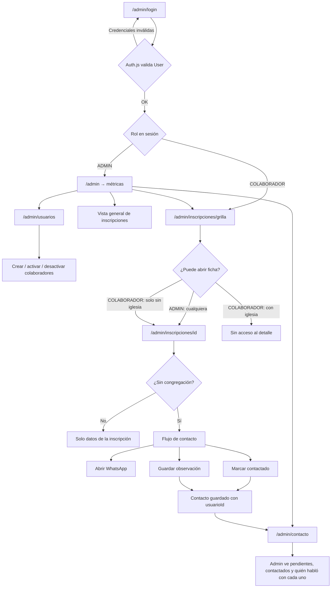

# Juntos en Casa Fieles

Aplicación web para la gestión de inscripciones del evento Juntos en Casa, con panel de administración y seguimiento de contacto.

## Requisitos

- Node.js 20+
- Docker y Docker Compose

## Configuración

```bash
# 1. Clonar e instalar dependencias
git clone <url-del-repo>
cd juntos-en-casa-fieles
npm install

# 2. Variables de entorno
cp .env.example .env
# Completar AUTH_SECRET (openssl rand -base64 32)

# 3. Base de datos
docker compose up -d
npx prisma migrate dev
npx prisma generate
npx prisma db seed

# 4. Servidor de desarrollo
npm run dev
```

La app corre en [http://localhost:3000](http://localhost:3000). El panel está en `/admin`.

El seed crea el usuario **ADMIN** a partir de `ADMIN_EMAIL` / `ADMIN_PASSWORD`. Los colaboradores se crean desde `/admin/usuarios`.

## Variables de entorno

| Variable | Descripción |
|---|---|
| `DATABASE_URL` | URL de conexión a PostgreSQL |
| `ADMIN_EMAIL` | Email del admin (solo para el seed) |
| `ADMIN_PASSWORD` | Password del admin (solo para el seed; se guarda hasheada) |
| `AUTH_SECRET` | Secreto de Auth.js para firmar la sesión JWT |
| `NEXT_PUBLIC_SITE_URL` | URL pública del sitio |
| `BLOB_READ_WRITE_TOKEN` | Token de Vercel Blob para subir las placas (PDF) de RECURSOS |

## Roles

| Rol | Acceso |
|---|---|
| `ADMIN` | Métricas, grilla, detalle, usuarios, panel de contacto |
| `COLABORADOR` | Grilla completa; detalle y contacto solo de inscriptos **sin iglesia** |

## Flujo del portal administrador



### Resumen del flujo de contacto

1. El **admin** crea colaboradores en `/admin/usuarios`.
2. El **colaborador** entra a la grilla y abre fichas de personas **sin congregación**.
3. En la ficha escribe por WhatsApp, marca “contactado” y deja una observación.
4. El **admin** revisa el avance en `/admin/contacto` (quién contactó a quién).

## Scripts útiles

| Comando | Descripción |
|---------|-------------|
| `npm run dev` | Servidor de desarrollo |
| `npm run build` | Build de producción |
| `npm run lint` | ESLint |
| `npx prisma studio` | Explorar la base de datos |
| `npx prisma db seed` | Poblar admin, congregaciones e inscripciones de prueba |
nada
## Estructura de carpetas

```
src/app/(external)/   → Páginas públicas (landing)
src/app/(internal)/   → Panel de administración
src/actions/          → Server actions por dominio
src/auth.config.ts    → Auth.js (NextAuth v5)
prisma/               → Schema y migraciones
```
